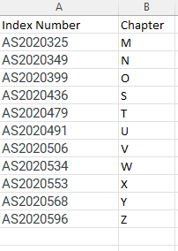

```{r setup, include=FALSE}
knitr::opts_chunk$set(echo = TRUE)
```

Total marks: 20 Marks

Task: 

This assignment is based on the incomplete version of Data Visualisation `geom` Encyclopedia available at

https://thiyangt.github.io/geom.encyclopedia/

Task 1:

I assigned incomplete chapters according to the order of index numbers as follows:



Complete the assigned chapters. Use the World Bank dataset for your examples whenever possible. If the World Bank data does not fit the geom you are working on, select an appropriate alternative dataset.


Task 2:

Select any other chapter and write a review. This could include missing geoms, better examples, and other additional information that you would think important to include.

Deadline: August 8, 2024